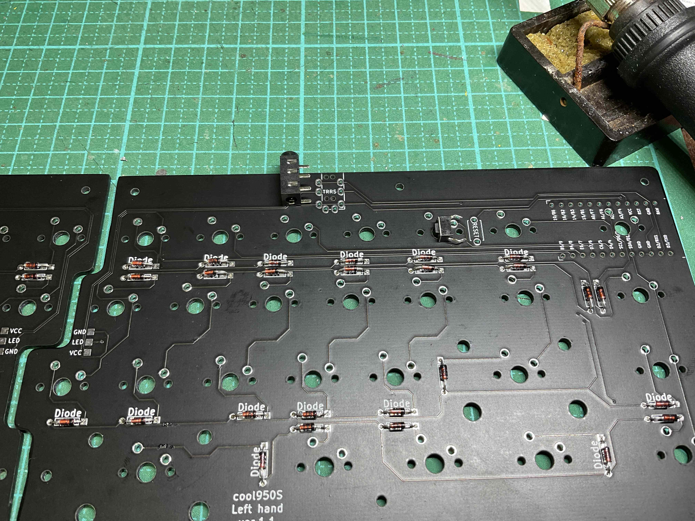
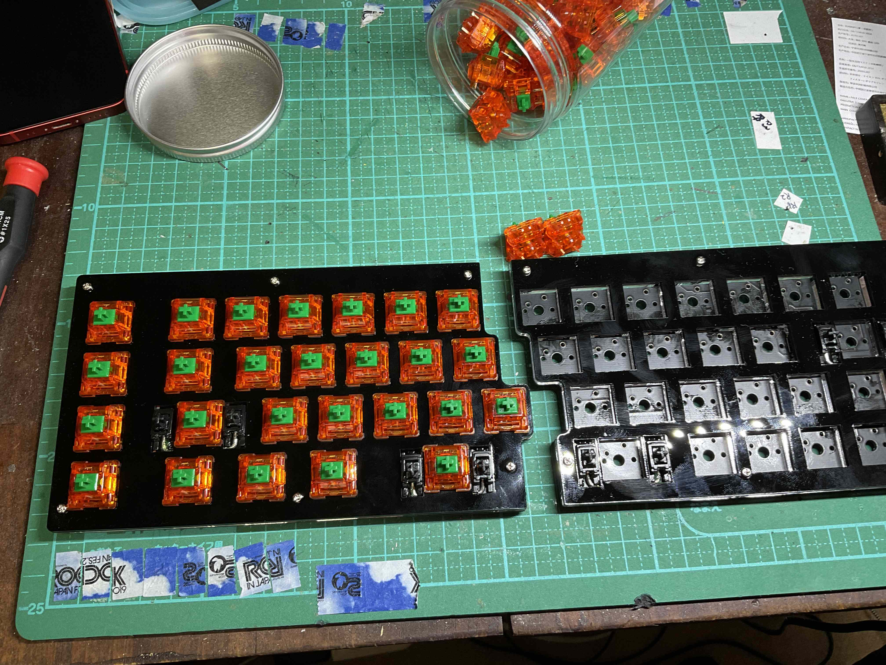

# cool950S　ビルドガイド
## 特徴
 
cool950Sは、m.kiが設計した40％分割キーボードです。 
入力に必要なキー以外を省略することでコンパクトにしました。 
トッププレートからアクリルを積層することで密閉型ケースに仕上げました。 
 

## 1　部品の確認
次の部品で構成されています。 
１　　PCB　左右それぞれ１枚 
２　　トッププレート　左右それぞれ１枚 
３　　トップアンダープレート　左右それぞれ１枚 
４　　ミドルプレート１　左右それぞれ４枚 
５　　ミドルプレート２　左右それぞれ１枚 
６　　ミドルプレート２　左右それぞれ１枚 
７　　ボトムプレート　左右それぞれ２枚 
８　　M２ネジ（４mm12本、８mm12本） 
９　　M２スペーサー３mm六角形タイプ６個、６mm六角形タイプ６個 
１０　Pro micro　２個 
１１　TRRSジャック　２個 
１２　タクトスイッチ　２個 
１３　TRRSケーブル １本 
１４　ダイオード　50個 
１５　LEDテープ　２枚 
１６　スタビライザー（２Uサイズ）　４個 
１８　キースイッチ　50個 
１９　キーキャップセット　※任意 
２０　USBケーブル（Pro microの端子に準拠したもの） 
 
部品のうち、 
１〜９、１１〜１３、１６はキットに同封されています。 
１０、１８、２０は遊舎工房、TALP KEYBOARDS、KOCHI KEYBOARDで店頭もしくはネット通販で購入可能です。 
１０のpro microについては、マック８コンスルー（スプリングピンヘッダ）が必要となります。 
 

## ２　ファームウェアについて
cool950Sはyouichiro氏の開発したREMAPにて、キーレイアウトの編集ができます。 
次の[Hexファイル]()をダウンロードしてください。そして、QMK TOOLBOXにてPro microへの書き込みをしてください。 
REMAPで作業するための[Jsonファイル](https://github.com/telzo2000/cool950S/blob/main/cool950S_remap.json)はこちらにあります。 
chromeを起動して、「REMAP」と検索し、REMAPのサイトへアクセスしてください。 
## ３　色塗り
PCBの側面を黒色マジックで塗ってください。
cool950Sはトッププレートが黒色アクリルプレートを使用していますので、
PCBの側面も同じ黒色のほうが格好良くなります。 
 

## ４　ダイオードのハンダ付け
ダイオードの足を曲げて取り付けて、ハンダ付けをします。 
ダイオードの足は、下面から「diode」と印刷された部分の穴に差し込みます。

短く切ったマスキングテープで固定してから、裏返して、上面に伸びたダイオードの足は切り離してください。

ダイオードには極性があります。ダイオードの黒い帯がある側が「diode」の文字の後ろになるようにハンダ付けしてください。
もし、文字の印刷がない場所は、他のダイオードの向きを確認して、同じようにハンダ付けをしてください。 
ハンダ付けに自信がない場合、フラックスを利用すると、上手にハンダ付けができます。 

その後、フラックスクリーナーで綺麗に拭き取ることをお勧めします。 
https://twitter.com/0002ozlet/status/1418881247648964608

## 5　タクトスイッチのハンダ付け
左右それぞれのPCBにタクトスイッチをハンダ付けします。 

PCBに「reset」の文字が印刷されています。

文字が隠れるようにタクトスイッチを置いて、その裏側からハンダ付けをします。 
https://twitter.com/0002ozlet/status/1418884394085879808
 
※ツイートで言うリセットスイッチとは、このタクトスイッチのことです。

## ６　TRRSジャックのハンダ付け
左右それぞれのPCBにTRRSジャックのハンダ付けをします。 
ダイオードやタクトスイッチを同じ側にTRRSジャックを取り付けます。
https://twitter.com/0002ozlet/status/1418896366999248897

## ７　スタビライザーの装着
４つのスタビライザーを装着します。左右のPCBの上側に２つずつ、装着します。 
装着する前に、スタビライザーにはルブをすることを推奨します。
ルブについては、様々な手法がありますので、ご自身で調べて実施してください。 

スタビライザーについては、一度装着しますと、cool950Sでは後日交換することが困難です。 
同封のスタビライザーは爪のある方を先に大きめの穴に引っ掛けてから、反対側を小さめの穴にはめ込みます。 

同封されているスタビライザーより、よいものもあります。
ご自身で調べて、付け替える等の判断をしてください。 
https://twitter.com/0002ozlet/status/1418897654382276611

## ８ トッププレートとトップアンダープレートの装着
左右それぞれのPCBの上（PCB上に「Front side」と表示）に、トッププレート、トップアンダープレートを上から順に重ねます。 
アクリルの保護紙を剥がす時は、ゆっくり丁寧に行ってください。 
力強く乱暴に剥がしますと、保護紙の粘着に引っ張られる形で、アクリルが破損する可能性があります。 
焦らず、丁寧が基本です。 

ネジ穴の位置を意識して、表裏、左右の向きを間違えないように重ねてください。 

重ねたら、ネジ穴に、M2ネジ8mmを上から通して、PCBの下側からM2スペーサー3mm及びM2スペーサー6mmで固定します。 
cool950Sでは、高さの違う２種類のスペーサーを使います。
原則、手前側にM2スペーサー3mm、奥側にM2スペーサー6mmを使います。 

ただし、アクリルの精度の問題から、M2スペーサー6mmではやや頭が出てしまうことがあります。 

奥側の中央と内側の２箇所（左右で４箇所）はM2スペーサー5mmを使うと、後述のミドルプレート１・２、ボトムプレートが隙間なく重なると思います。 
https://twitter.com/0002ozlet/status/1418898629901815812

## ９　キースイッチのハンダ付け
トッププレート側から、キースッチを装着して、ハンダ付けをします。 
キースイッチを強く差し込みます。差し込んだ時PCBの下側に、キースイッチの端子が少し、はみ出ます。

もし、はみ出ていない時は、端子が曲がったまま、差し込まれています。
一度、キースイッチを外して、曲がった端子を修正して、差し込み直してください。 
キースイッチを差し込み終えたら、PCBの下側から、キースイッチの端子にハンダ付けをします。 

pro microを被さるように設置する箇所のキースイッチでは、
ショート防止のため、キースイッチの端子の先をニッパーでカットします。 

ここまでくると、ゴールは近いです。 

## １０　LEDテープのハンダ付け（任意）
別途購入したLEDテープがあれば、PCBにハンダ付けをします。 

ハンダ付けではフラックスを多めに塗布して、
ハンダをたっぷりと流し込んで、ブリッジさせます。 
ブリッジが上手にできない時、ダイオードの切り離した足を、必要な長さに切ります。 
切り離した足を、PCBの端子とLEDテープの端子とがつながるような位置でハンダ付けをします。この方法で繋ぐことができます。 
光らせることに興味がない場合は、装着しなくてもキーボードとしての機能に問題はありません。
しかし、光らないよりは光るほうが、キーボードは格好良く見えます。LEDテープを装着することを推奨します。 
また、しばらく、LEDテープなしで使用してみて、後で光らせたくなっても大丈夫です。 
LED装着して光らせた様子 
https://twitter.com/0002ozlet/status/1418925920866299905

##　１１　pro microの装着
cool950Sではマック８コンスルー（スプリングピンヘッダ）を使用してのpro microを装着します。 
マック８コンスルー（スプリングピンヘッダ）の向きに気をつけて使用してください。
pro microに装着している面が下に向くように（PCBに向くように）してください。
pro microは左右それぞれに付けます。 
pro microは、パーツが付いている面がPCBに向くように装着します。 
ハンダ付けが難しい部分があります。
フラックスを多めに塗布して、ハンダを流すように取り付けると上手くいきます。 

## １２　導通テスト
ここで一度、動作確認をすることをお勧めます。 
pro microにファームウェアを入れて、仮にキーキャップを差し込んで、
キースイッチを打鍵した時に反応するかどうか、確認してください。
打鍵したけど、入力されない時は、ダイオードの向きが間違っていないか、
キースイッチ等のハンダ付けの不備が原因になります。テスターで導通を確認してください。
入力確認には、次のサイトがお勧めです。 
https://keyboardchecker.com 

## １３　ミドルプレート１・２、ボトムプレートの装着
PCBの下側に、ミドルプレート１・２、ボトムプレートを装着します。 
最初にミドルプレート１（隙間の多いアクリルプレートです）を重ねます。 

特に右手側のミドルプレート１（上の画像だと、左側にあります）は形状的にpro micro付近が破損しやすいので、注意して取り扱ってください。 
次にミドルプレート２を重ねます。

重ねたら、左右それぞれ手前側の合計６箇所に、ねじ止めをします。 
M2ネジ3mmで固定してください。
最後にボトムプレートを重ねます。 

重ねたら、左右それぞれ奥側の合計６箇所に、ねじ止めをします。 

M2ネジ3mmで固定してください。 

ここで、奥側のM2スペーサー6mmではなく、5mmを使っている場合、ネジが上手くしまらないことがあります。
その時は、トッププレート側のネジを少し緩めると、ボトムプレート側のネジがしまります。
その後、トップレート側のネジをしめてください。 

## １４　ゴム足の装着（任意）
別途購入したゴム足を左右それぞれに取り付けてください。 

## １５　キーキャップの装着
お気に入りのキーキャップを入手して、装着してください。 

cool950Sの特徴の一つは、キーキャップの選択の幅が広いことです。
キーキャップのベースキットであれば、そこに含まれているキーキャップのみで、cool950Sに装着できます。
一部だけ、別のキーキャップを装着することなく、対応できます。 
これで完成です。 

自分だけのcool950Sができましたか。 
https://twitter.com/0002ozlet/status/1418931413609369602
打鍵テストの様子 
https://twitter.com/0002ozlet/status/1418936223045865472